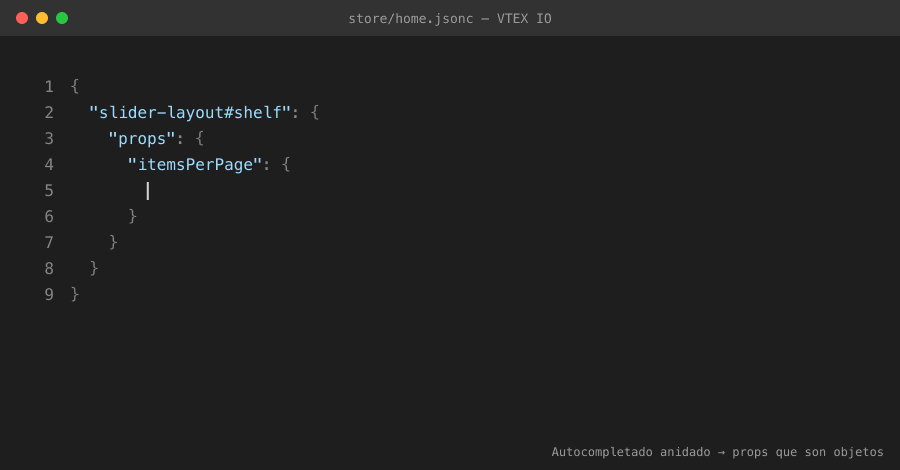

<p align="center">
  
</p>

<h1 align="center">VTEX IO Store Framework Snippets</h1>

<p align="center">
  Autocompletado e IntelliSense para los bloques de VTEX IO Store Framework.
</p>

<p align="center">
  <a href="https://marketplace.visualstudio.com/items?itemName=commenteme.vtex-io-intellisense"></a>
  <a href="https://marketplace.visualstudio.com/items?itemName=commenteme.vtex-io-intellisense"></a>
  <a href="https://marketplace.visualstudio.com/items?itemName=commenteme.vtex-io-intellisense"></a>
  
</p>

<p align="center">
  
</p>

---

Extensión de VS Code que acelera la escritura de los archivos de tema de VTEX IO Store Framework (`store/blocks.json`, `store/blocks/*.jsonc`, `store/routes.json`, `store/contentSchemas.json`).

## ¿Qué hace?

Ofrece **dos capas de autocompletado**:

1. **Snippets de bloques** — escribe el nombre del bloque e inserta el bloque completo listo, con placeholders navegables con Tab.
2. **IntelliSense de props (JSON Schema)** — dentro de un bloque, el editor sugiere las **props válidas de ese bloque**, muestra las **opciones (enums)**, los **defaults** y las **descripciones**. Se aplica automáticamente a los archivos de bloques, sin configuración.

Cobertura actual: **370 bloques** de **~65 apps** del Store Framework, con **~1.300 props** documentadas, extraídas de la documentación oficial de VTEX. La cobertura frente al ground-truth (los `store/interfaces.json` de cada app) es del **93 %** de los bloques nativos exigidos.

## Instalación

- **Marketplace:** busca **"VTEX IO Store Framework Snippets"** en la pestaña Extensions de VS Code, o instala por CLI:
  ```bash
  code --install-extension commenteme.vtex-io-intellisense
  ```
- **Manual (.vsix):** descarga el `.vsix` desde [Releases](https://github.com/zeluizr/vtex-io-snippets/releases) y ejecuta `code --install-extension vtex-io-intellisense-*.vsix`.

## Uso

### Insertar un bloque (snippets)

En cualquier archivo `.json`/`.jsonc` del tema, escribe el **nombre del bloque** (ej.: `flex-layout.row`, `rich-text`, `product-summary.shelf`) o el atajo corto `v-` (ej.: `v-flex-row`). Usa **Tab** para navegar por los placeholders.

```jsonc
"rich-text#hero": {
  "props": {
    "text": "Texto en **Markdown**",
    "textAlignment": "CENTER"
  }
}
```

### Autocompletar props (IntelliSense)

Dentro de `"props": { }` de un bloque, presiona `Ctrl+Espacio` y el editor lista las props de ese bloque con sus opciones. Funciona en:

- `store/blocks.json` / `store/blocks.jsonc`
- `store/blocks/**/*.json` / `store/blocks/**/*.jsonc`
- cualquier `*.jsonc` bajo `store/**` (p. ej. `store/home.jsonc`)

> Para que las sugerencias aparezcan **mientras escribes** (y no solo con `Ctrl+Espacio`), activa las sugerencias en strings en tu `settings.json`:
> ```json
> "[jsonc]": { "editor.quickSuggestions": { "strings": true } },
> "[json]":  { "editor.quickSuggestions": { "strings": true } }
> ```
> Asegúrate también de que los `.jsonc` estén en el modo de lenguaje **JSON with Comments**.

### Navegar entre bloques

En los archivos de tema bajo `store/**` (incluye `store/blocks/**`, `store/home.jsonc`, `store/blocks.jsonc` y subcarpetas), los ids de bloque se vuelven navegables:

- **Ir a la definición** (`Cmd/Ctrl+clic` o `F12`): desde una referencia en `children`/`blocks`/`before`/`after`/`around` salta a donde el bloque está definido (`"id": { … }`), incluso en otro archivo.
- **Buscar todas las referencias** (`Shift+F12`): lista todos los usos del bloque en el tema.
- **Hover**: muestra en qué archivo y línea está definido el bloque y cuántas referencias tiene.

## Cobertura

Bloques nativos de VTEX IO Store Framework cubiertos por snippets + schema de props:

- **Layout:** `flex-layout.row/col`, `slider-layout`, `responsive-layout`, `condition-layout`, `tab-layout`, `modal-layout`, `sticky-layout`, `stack-layout`, `disclosure-layout`, `overlay-layout`
- **Contenido:** `rich-text`, `image`, `info-card`, `call-to-action`, `newsletter`
- **Header/Footer:** `header-layout`, `footer-layout`, `logo`, `search-bar`, `minicart`, `login`, `menu`, `drawer`
- **PDP:** `product-images`, `product-name`, `product-identifier`, precios (`product-selling-price`, `product-list-price`, `product-installments`), `product-quantity`, `sku-selector`, `buy-button`, `product-description`, `product-specifications`, `product-gifts`, `product-highlights`, `share`, `breadcrumb`
- **Vitrina:** `product-summary.shelf`, `product-summary-*`, `shelf`, `add-to-cart-button`, `list-context.product-list`
- **Búsqueda:** `search-result-layout(.desktop/.mobile)`, `gallery`, `filter-navigator.v3`, `order-by.v2`, `total-products.v2`
- **Plantillas de página:** `store.home`, `store.product`, `store.search`, `store.custom`, `store.account`, etc.
- **Reseñas / regionalización:** `reviews-and-ratings`, `product-reviews`, `delivery-promise-components`, `shipping-option-components`

> El schema es **tolerante**: solo valida estrictamente **enums** y **booleanos**; el resto de props mantiene autocompletado de nombre + descripción sin marcar valores válidos como error.

Quedan **fuera de alcance** (intencionalmente): el blog (`vtex.blog-interfaces`), `sandbox`, `pwa-components` y las versiones legadas `filter-navigator.v1/v2`, `order-by` (v1) y `total-products` (v1), ya que existen las versiones actuales.

## Cómo se construyó

- Los datos de props se extraen de la **documentación oficial de VTEX** mediante un proceso automatizado y se consolidan en `data/blocks.json`.
- `scripts/generate-schema.js` genera de forma **determinística** el JSON Schema (`schemas/vtex-blocks.schema.json`) y los snippets (`snippets/vtex-io.code-snippets`) a partir de esos datos.
- `scripts/check-coverage.js` audita la cobertura contra el **ground-truth**: el `store/interfaces.json` de cada app de VTEX (la lista autoritativa de bloques). Genera `docs/coverage-report.md` y `data/coverage.json`.
- Una **GitHub Action** (`.github/workflows/coverage.yml`) ejecuta esa auditoría semanalmente, abre/actualiza automáticamente un *issue* cuando VTEX agrega bloques nuevos sin cobertura (label `coverage-gap`) y lo cierra cuando se resuelven.
- Otra **GitHub Action** (`.github/workflows/publish.yml`) publica en el Marketplace y adjunta el `.vsix` al Release al crear un tag `v*`.

## Contribuir

Para regenerar el schema y los snippets tras actualizar `data/blocks.json`:

```bash
node scripts/generate-schema.js
```

Para auditar la cobertura localmente:

```bash
node scripts/check-coverage.js
```

Si decides **no cubrir** un bloque (aceptar el gap), agrega su ID en `data/coverage-accepted.json` y el *issue* automático se cerrará en la próxima auditoría.

## Licencia

MIT
