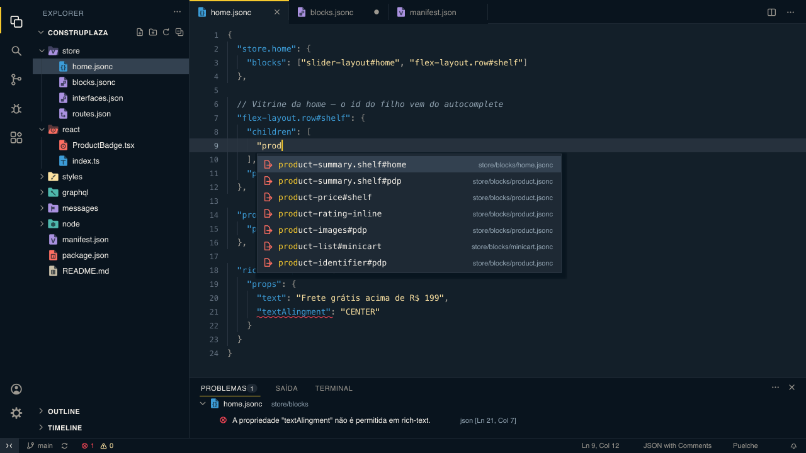

# inmmerce for VTEX

**Tema, iconos, snippets e IntelliSense para quien construye en VTEX.**

[](https://marketplace.visualstudio.com/items?itemName=commenteme.vtex-io-intellisense)
[](https://marketplace.visualstudio.com/items?itemName=commenteme.vtex-io-intellisense)
[](./LICENSE)

Extensión de VS Code con todo lo que necesita un tema de **VTEX IO Store Framework**:
snippets de bloques y props (con enums y validación) en `store/blocks`, rutas y
contentSchemas, validación de JSON, autocompletado de las variables CSS del VTEX Style, y
un tema de color con sus iconos de archivo y de interfaz.



---

## Instalación

Desde el **VS Code Marketplace**: busca **«inmmerce for VTEX»**, o instálala desde Quick
Open (`Cmd/Ctrl + P`):

```
ext install commenteme.vtex-io-intellisense
```

## Uso

1. Abre un tema de **VTEX IO Store Framework**.
2. En los archivos `.json` / `.jsonc` de `store/` (por ejemplo `store/blocks/*.jsonc`), empieza
   a escribir el nombre de un bloque para disparar el snippet y el autocompletado.
3. Las props se autocompletan con sus **enums** y se **validan** contra el esquema de bloques
   (`blocks.json`, `store/blocks/**/*.json`, `store/**/*.jsonc`).

Las sugerencias son **sensibles al contexto**: el bloque completo sólo aparece en la raíz del
archivo, donde de verdad se define; dentro de `children` / `blocks` / `before` / `after` /
`around` se sugieren los **ids ya definidos** en el tema; y dentro de `props` sólo manda el
esquema, con las propiedades del bloque.

No necesita configuración: la extensión activa las sugerencias dentro de strings para
`json` / `jsonc` y la validación de JSON se enciende sola en esos archivos.

### Variables CSS del VTEX Style

En archivos `css`, `scss`, `less` y `postcss` la extensión también autocompleta las **CSS
custom properties** que VTEX expone en runtime a partir de tu JSON de tokens (el mismo
formato del `style.json` nativo): `var(--emphasis)`, `var(--spacing-2)`,
`var(--type-scale-1)`, `var(--background-action-primary)`…

- Se dispara al escribir `-` o `(`. Si el cursor ya está dentro de `var(`, inserta sólo el
  nombre; si no, inserta `var(--nombre)` completo.
- Las variables de **color** se muestran con su *swatch* (color preview) y el valor.

**Origen de los tokens (por prioridad):** primero `styles/configs/tokens.json`, luego
`tokens.json` en la raíz del workspace, y si no hay ninguno cae a un `tokens.json` embebido
en la extensión con los valores por defecto de VTEX. Los cambios en cualquier `tokens.json`
se recargan solos.

**Comando `VTEX: Gerar tokens.css`** (paleta de comandos, `Cmd/Ctrl + Shift + P`): exporta un
`:root { ... }` con **todas** las variables generadas, guardado junto al JSON de origen.

## El tema Puelche

Un tema oscuro y de **baja saturación**, pensado para sesiones largas: la identidad de la
extensión vive en el *chrome* de la interfaz (cursor, pestaña activa, badges), no en el
resaltado de sintaxis, que se queda tranquilo para que puedas leer código durante horas.

Actívalo con `Cmd/Ctrl + K` seguido de `Cmd/Ctrl + T` y elige **Puelche** en la lista.

### Colorea por papel, no por lenguaje

Hay **9 papeles semánticos** y todos los lenguajes se mapean sobre esos mismos 9. Una
etiqueta HTML, un componente JSX, un selector de elemento CSS, un decorador de Python, un
atributo de Prisma, una directiva de GraphQL y un título de Markdown reciben **el mismo
color**, porque todos son "estructura con nombre". Aprendes el mapa una vez y sirve para
todos los archivos.

| Papel | Color |
| --- | --- |
| Palabras clave | `#A78BC7` |
| Funciones y campos | `#7FC3AE` |
| Tipos y propiedades | `#86AECB` |
| Strings | `#C4A47C` |
| Números y constantes | `#C08A6B` |
| Estructura con nombre | `#C4788F` |
| Variables y prosa | `#D6D2DF` |
| Puntuación | `#8A8496` |
| Comentarios | `#9A91A8` |

### Legibilidad

- Los comentarios **no** están apagados: quedan en **5.85:1** de contraste, por encima del
  mínimo de accesibilidad. Un comentario que no se lee es un comentario que no se escribe.
- El **cuerpo de texto de Markdown se queda sin color**, para que un README siga leyéndose
  como prosa y no como código.
- La **cursiva sustituye a los colores extra**: comentarios, parámetros, `self` / `cls`,
  atributos HTML y JSX, `import` / `from` y blockquote. Un matiz más, no un color más.
- El color de **acento sólo aparece en el chrome** (cursor, pestaña activa, badge). Nunca
  colorea texto de código.

## Iconos de archivo y carpeta

72 dibujos propios, *monoline* y coloreados con el **mismo esquema de papeles** que el
tema, así que el explorador y el editor hablan el mismo idioma visual.

Actívalos desde la paleta de comandos (`Cmd/Ctrl + Shift + P`) con
**`Preferences: File Icon Theme`** → **Puelche**.

Lo que los diferencia de un pack genérico es que cubren la estructura real de una app de
**VTEX IO**: icono propio para las carpetas `store`, `react`, `node`, `graphql`,
`messages`, `pixel`, `admin` y `styles`, y para los archivos `manifest.json`,
`routes.json`, `blocks.json`, `interfaces.json` y `.vtexignore`. En total, ~80 extensiones,
~62 nombres de archivo y 26 `languageIds`.

## Iconos de la interfaz

El *product icon theme* reemplaza los iconos de la propia UI de VS Code por un conjunto
propio, en la misma línea monoline de los iconos de archivo: **58 glifos** dibujados a mano
que cubren la barra de actividad, el layout y la barra de título, la barra de estado, el
árbol del explorador, pestañas y editor, paneles, acciones comunes y feedback. Se sirven
como 93 entradas, porque 35 codicons distintos comparten dibujo con otro.

Actívalo desde la paleta de comandos con **`Preferences: Product Icon Theme`** →
**Puelche**.

La cobertura es parcial **a propósito**: los iconos que no están cubiertos siguen usando el
codicon nativo de VS Code, que siempre se verá mejor que un dibujo forzado. Para que la
mezcla no se note, la fuente usa las mismas métricas que el codicon nativo (`unitsPerEm`
1000, razón 1.0), así que los glifos propios y los nativos comparten línea base y tamaño.

## Solución de problemas

**No aparece ninguna sugerencia de bloque.** Sólo se ofrecen en archivos bajo `store/`, y el
bloque completo únicamente en la raíz del archivo. Dentro de `props` es intencional que no
aparezca: ahí sólo caben propiedades.

**`Ctrl + Espacio` no abre las sugerencias (macOS).** macOS se queda con ese atajo para
*Seleccionar la fuente de entrada anterior*, así que nunca llega a VS Code. Dos salidas:

- Usa `Cmd + I`, que también dispara las sugerencias en VS Code.
- O libera el atajo en **Ajustes del Sistema → Teclado → Atajos de teclado → Fuentes de entrada**
  y desmarca *Seleccionar la fuente de entrada anterior*.

---

vtex-io-snippets es **open source** bajo licencia [MIT](./LICENSE).

_Hecho con amor y café por [zeluizr](https://github.com/zeluizr) y con la ayuda de [Claude](https://claude.ai/referral/Cz_UimA0NQ) ☕_
